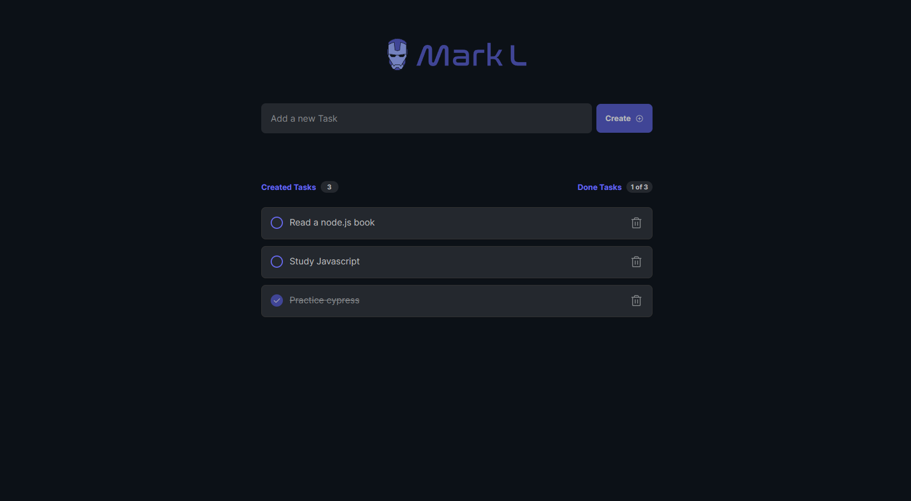

# cypress-express
 
Automated tests for web application using Cypress.

## 📚 Course
[Cypress eXpress - Udemy](https://www.udemy.com/course/cypress-express/)

## ✅ What I learned
- Automated Web testing
- Automated API testing
- Variables and constants
- Custom commands
- Alias and invoke
- Contexts (create, update, delete)
- Validate CSS properties
- Add options (baseUrl, viewport) and env variables (apiUrl) in cypress.config file
- Test data in fixtures (json file)
- before, beforeEach
- Allure report plugin

## 🌐 Application
MarkL is a ToDo list web application which enables users to create, complete and delete tasks.

